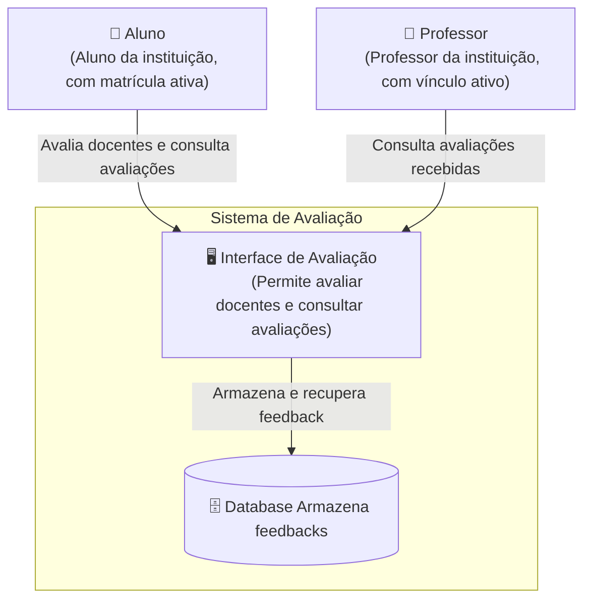

```mermaid
flowchart TB
    %% Pessoas (atores)
    A["👤 Aluno
    (Aluno da instituição, com matrícula ativa)"]
    B["👤 Professor
    (Professor da instituição, com vínculo ativo)"]

    %% Sistemas internos
    subgraph SI ["Sistema de Avaliação"]
        AA["🖥 Interface de Avaliação
        (Permite avaliar docentes e consultar avaliações)"]
        DB[(🗄 Database Armazena feedbacks)]
    end

    %% Relações
    A -->|Avalia docentes e consulta avaliações| AA
    B -->|Consulta avaliações recebidas| AA
    AA -->|Armazena e recupera feedback| DB
```
