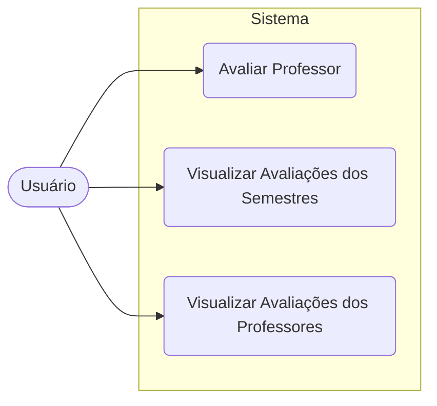

# Caso de Uso

```mermaid
flowchart LR
%% Atores
Usuario([Usuário])

%% Casos de uso
subgraph "Sistema"
A1(Avaliar Professor)
A2(Visualizar Avaliações dos Semestres)
A3(Visualizar Avaliações dos Professores)
end

%% Relações
Usuario --> A1
Usuario --> A2
Usuario --> A3
```
